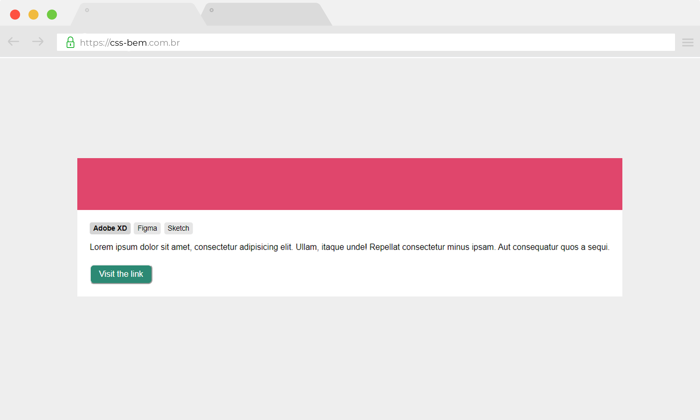

<h1 align="center">
    
</h1>

## 📝 Módulo 2 - "Hora do código"
# CSS BEM (Block - Element - Modifier)
Códigos da aula "Hora do código" onde foi desenvolvido um simples exemplo aplicando os conceitos da metodologia BEM.

<h1 align="center">
    
</h1>