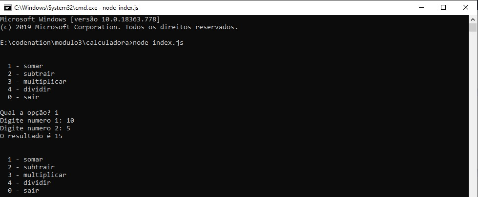

<h1 align="center">
    
</h1>

## 📝 Módulo 3 - "Hora do código"
# "Calculadora"
Códigos da aula "Hora do código" onde foi desenvolvido um simples exemplo com uma espécie de calculadora para entender conceitos básicos de JavaScript como variáveis, operadores e funções.

<h1 align="center">
    
</h1>