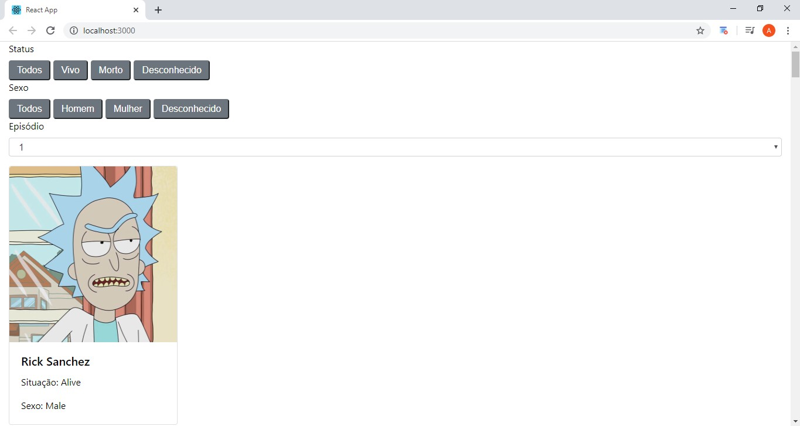

<h1 align="center">
    
</h1>

## 📝 Módulo 5 - "Hora do código"
# "Ricky Morty"
Códigos das aulas "Hora do código" onde foi desenvolvida uma listagem de cards dinâmicos
do seriado Ricky Morty, contendo filtros e seleção por episódio. Foi dada início a utilização
do React.

<h1 align="center">
    
</h1>