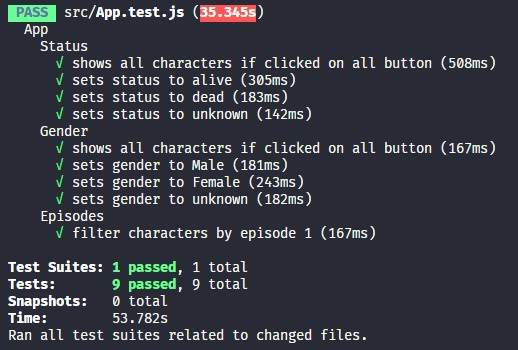

<h1 align="center">
    
</h1>

## 📝 Módulo 6 - "Hora do código"
# "Ricky Morty"
Códigos da aula "Hora do código" onde foi desenvolvida a parte de testes, usando a biblioteca React Testing Library, da aplicação que vem sendo trabalhada durante os módulos.

<h1 align="center">
    
</h1>