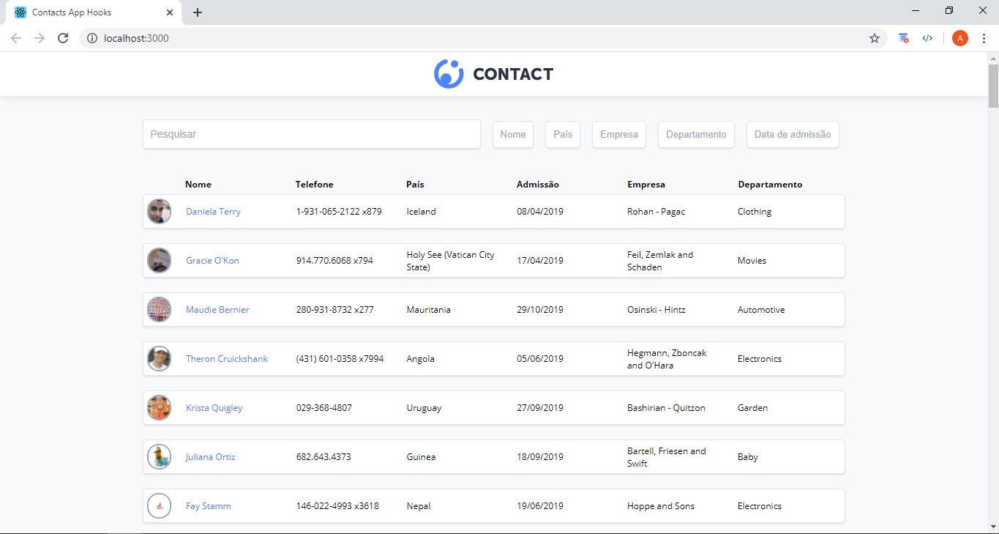

<h1 align="center">
    
</h1>

## 📝 Módulo 7 - Refatorando o desafio da aula 6 com Hooks
# "Contacts App with Hooks"
Códigos da aula 'Refatorando o desafio da aula 6 com Hooks' onde foi refatorado o desafio realizado no módulo 6, reescrevendo os códigos anteriormente em forma de _Class Component_ para _Functional Components_ usando os _Hooks_

<h1 align="center">
    
</h1>