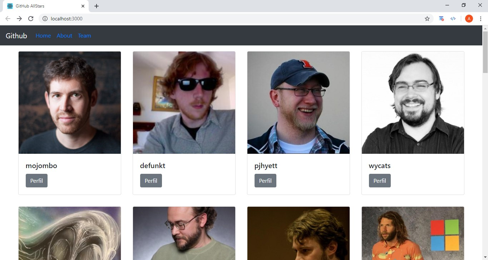

<h1 align="center">
    
</h1>

## 📝 Módulo 7 - "Hora do código"
# "GitHub AllStars"
Códigos da aula "Hora do código" onde foi desenvolvida uma aplicação React usando Hooks que lista e exibe detalhes de perfis do Github consumindo sua API pública.

<h1 align="center">
    
</h1>